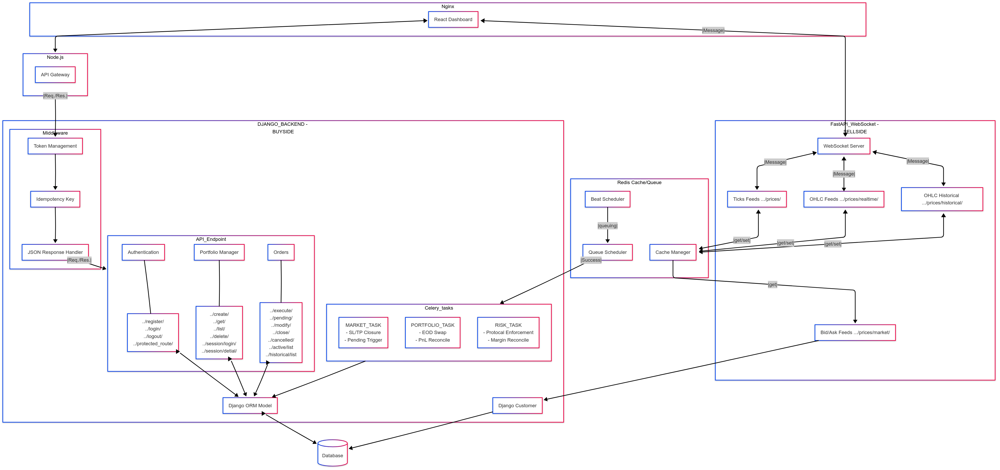

> ⬅️ [Back to Project Overview](../README.md)

# 🧩 System Architecture – PQTradePlatform

## Overview

PQTradePlatform is a full-stack trading simulation platform built to mirror real-world trading environments. It combines:
- Modular backend logic for order handling and risk enforcement
- A real-time pricing engine with OHLC/Tick feeds
- Role-based dashboards (Trader, Admin, Observer)
- Middleware-protected APIs and asynchronous task orchestration

---

## 🔄 High-Level Architecture

---

## 🧠 Key Components (Aligned with Diagram)

### 🌐 Nginx Gateway
- Routes client requests from the React dashboard to either:
  - **Node.js Gateway** (REST API)
  - **FastAPI Market Service** (WebSocket)

---

### 🔁 Node.js Gateway (API Proxy)
- Proxies REST requests from the React SPA to the Django backend
- Handles preliminary validation, logging, and message shaping

---

### 🧠 Django Backend – Buy-Side Core

#### 🔐 Middleware
- **Token Management**: JWT validation, blacklist, portfolio scoping
- **Idempotency Key**: Prevents duplicate orders
- **Response Handler**: Ensures structured API replies with status and payload

#### 🧾 API Endpoint Modules
- **Authentication**
  - `/register/`, `/login/`, `/logout/`, `/protected_route/`
- **Portfolio Manager**
  - `/create/`, `/get/`, `/list/`, `/delete/`
  - `/session/login/`, `/session/detail/`
- **Orders**
  - `/execute/`, `/pending/`, `/modify/`, `/close/`, `/cancelled/`
  - `/active/list`, `/historical/list`

#### ⚙️ Celery Task System
- **MARKET_TASKS**: SL/TP trigger closures, pending order matching
- **PORTFOLIO_TASKS**: End-of-day swaps, PnL reconciliation
- **RISK_TASKS**: Margin validation, protocol enforcement

#### 🗃 Django ORM & Database
- Models for users, portfolios, positions, and orders
- Central PostgreSQL database with shared access from Celery

---

### 📡 FastAPI Market Service – Sell-Side Engine

#### 🛰 WebSocket Server
- Handles real-time subscriptions from the frontend

#### 📈 Price Feed Modules
- `/prices/market/` – Live bid/ask feed
- `/prices/` – Tick-level updates
- `/prices/realtime/` – OHLC candles (1s basis)
- `/prices/historical/` – Delayed historical OHLC bars

---

### 🔁 Redis – Shared Caching & Queue System
- **Cache Manager**: Stores latest bid/ask, ticks, OHLC data
- **Beat Scheduler**: Periodic task triggers (bar closing, heartbeat)
- **Queue Scheduler**: Connects task results back into Celery workflows

---

## ⚙️ Deployment

- Deployed on **AWS EC2 (t2.micro)** with:
  - PM2 process manager for backend/web services
  - Redis & PostgreSQL as local services
  - SWAP tuning and process grouping for efficiency

---

## 🧩 Security & Modularity

- JWT + Session Portfolio → Scoped access and tracking
- Token Blacklist + Refresh Rotation
- All modules follow single-responsibility, message-safe structure

---

_Last updated: April 2025_
