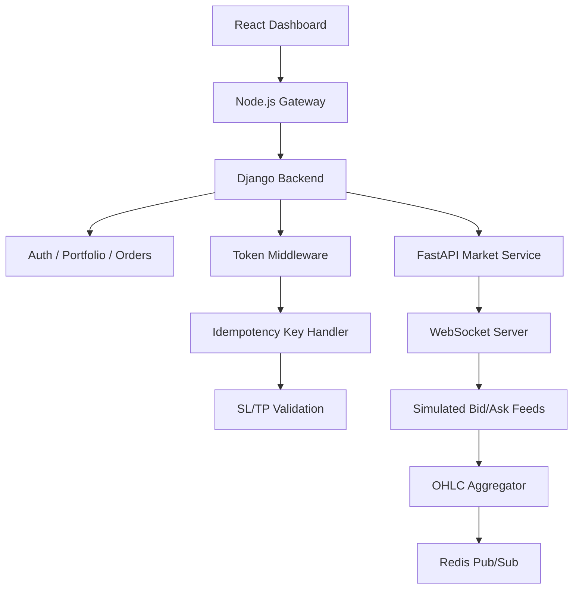

# 🧩 System Architecture – PQTradePlatform

## Overview

PQTradePlatform is a full-stack trading simulation platform built to emulate the lifecycle of real-time market execution, portfolio session handling, and research infrastructure.

It combines modular backend architecture, WebSocket-based streaming, and role-based frontend dashboards to support:
- Trader-side execution and management
- Admin monitoring and PnL tracking
- Investor (Observer Mode) view-only access

---

## 🔄 High-Level Architecture

<pre markdown="1">

</pre>
---

## 🧠 Key Components

### 🔐 **Django Backend**
- Handles authentication, token versioning, portfolio session management
- All trade order requests (Market, Limit, Stop) are processed here
- Business logic (SL/TP validation, PnL, margin) is session-aware
- Interfaces with PostgreSQL for persistent storage

### 🚀 **FastAPI Market Service**
- Simulates live market data with spread-aware bid/ask ticks
- Broadcasts OHLC bars across M1–D1 via WebSocket
- Publishes real-time updates to Redis (Pub/Sub channels)

### 🔌 **WebSocket Integration**
- WebSocket clients connect to FastAPI for live price feeds
- Frontend subscribes to symbols/timeframes and receives stream updates
- Prices are also consumed internally by Django via Redis for validation and execution

### ⚙️ **Celery + Redis Worker**
- Asynchronous handling of:
  - SL/TP triggers
  - Margin checks
  - Post-trade logging and cleanup
- Redis also used for live market price caching and broadcast channels

---

## 🖥️ Frontend SPA (React + TailwindCSS)

- Trader Panel: Execute, monitor, and manage open orders
- Admin Panel: Review system health, user positions, risk metrics
- Observer Mode: Read-only view of trader performance (no order access)

Real-time updates via WebSocket client, with session token-based routing.

---

## 🛠 Deployment Architecture

- Deployed on **AWS EC2 (t2.micro)** with resource tuning
  - Redis and PostgreSQL run locally or via managed services
  - PM2 orchestrates services: FastAPI, Django, Celery
  - SWAP memory used to extend system capability under limited RAM
- Future-ready for Docker Compose / Kubernetes deployment model

---

## 🔐 Security Design

- JWT with session tracking and token versioning
- Middleware enforces portfolio scoping on every request
- Idempotency Key prevents accidental order duplication
- Token blacklist model enables logout/revoke workflows

---

## 📈 Scalability Considerations

- Stateless backend: all session validation handled via token and cache
- Real-time feeds can be scaled across multiple clients per symbol
- Pub/Sub architecture allows downstream consumers (dashboard, risk engine, ML modules)
- Components are modular and microservice-compatible

---

## 🧠 Planned Extensions

- Live market integration (Binance, FXCM)
- AI signal-based execution triggers
- Strategy backtester module (in sync with historical bars)
- User tiering: multiple traders, investors, and admin control levels

---

## 📎 Related Files

- [`websocket_protocol.md`](./websocket_protocol.md) – message format, subscription lifecycle  
- [`api_reference.md`](./api_reference.md) – endpoint documentation  
- [`order_lifecycle.md`](./order_lifecycle.md) – order flow from open to close  
- [`performance.md`](./performance.md) – CPU/latency/load benchmarks  

---

_Last updated: April 2025_

